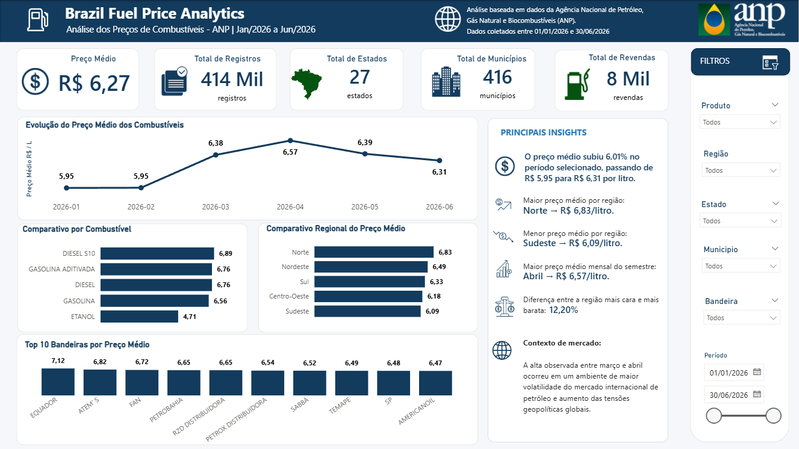
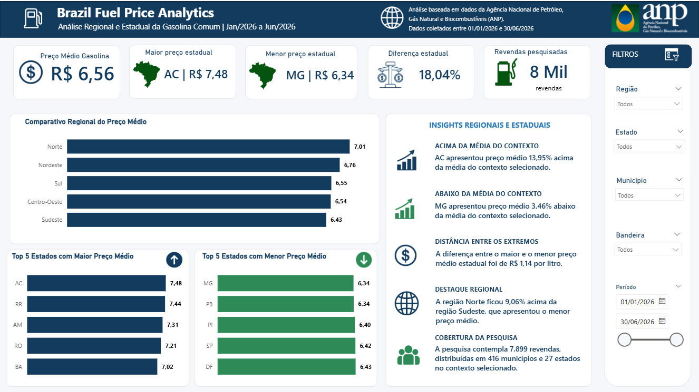
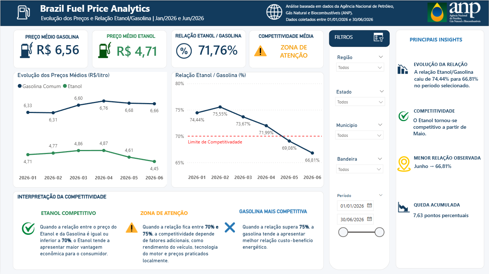

# Brazil Fuel Price Analytics


## Visão geral

O **Brazil Fuel Price Analytics** é um projeto de análise de dados desenvolvido para explorar o comportamento dos preços de combustíveis automotivos no Brasil durante o primeiro semestre de 2026.

A solução utiliza dados públicos da **Agência Nacional do Petróleo, Gás Natural e Biocombustíveis (ANP)** e reúne tratamento de dados com Python, análise exploratória, modelagem no Power BI, medidas DAX, indicadores dinâmicos e storytelling executivo.

O projeto foi criado para fins educacionais e de portfólio, com foco na demonstração de competências aplicadas a uma rotina de **Data Analytics e Business Intelligence**.

## Objetivos

- Analisar a evolução dos preços de combustíveis ao longo do período.
- Comparar preços médios por produto, região, estado, município e bandeira.
- Identificar estados e regiões com maiores e menores preços médios de Gasolina Comum.
- Avaliar a dispersão dos preços entre municípios.
- Examinar a relação de preços entre Etanol e Gasolina.
- Identificar períodos de maior competitividade relativa do Etanol.
- Construir um dashboard executivo, interativo e orientado à tomada de decisão.

## Fonte dos dados

Os dados são provenientes da série histórica pública de preços de combustíveis disponibilizada pela ANP:

- **Instituição:** Agência Nacional do Petróleo, Gás Natural e Biocombustíveis
- **Base utilizada:** Preços semestrais de combustíveis automotivos
- **Período analisado:** 1º de janeiro de 2026 a 30 de junho de 2026
- **Formato original:** CSV
- **Página oficial:** https://www.gov.br/anp/pt-br/centrais-de-conteudo/dados-abertos/serie-historica-de-precos-de-combustiveis

> Os resultados representam médias dos registros disponíveis na pesquisa da ANP e não são ponderados por volume comercializado.

## Escopo da base tratada

| Indicador | Resultado |
|---|---:|
| Registros originais | 422.418 |
| Duplicidades completas removidas | 6 |
| Registros finais | 422.412 |
| Regiões | 5 |
| Estados | 27 |
| Municípios distintos | 416 |
| Revendas distintas | 7.963 |
| Bandeiras | 47 |
| Produtos | 6 |

### Produtos disponíveis

- Diesel
- Diesel S10
- Etanol
- Gasolina
- Gasolina Aditivada
- GNV

> O GNV é medido em **R$/m³**, enquanto os demais produtos são medidos em **R$/litro**. Por esse motivo, análises consolidadas de combustíveis líquidos excluem o GNV.

## Tecnologias utilizadas

- **Python:** tratamento, validação e análise exploratória
- **Pandas:** manipulação e agregação dos dados
- **Jupyter Notebook:** documentação das etapas analíticas
- **Power Query:** importação e validação dos tipos de dados
- **Power BI:** modelagem, visualização e interação
- **DAX:** indicadores, rankings, textos dinâmicos e regras de competitividade
- **Git e GitHub:** versionamento e documentação do projeto

## Etapas do projeto

### 1. Análise exploratória

- Inspeção da estrutura da base.
- Avaliação dos tipos de dados.
- Diagnóstico de valores ausentes.
- Identificação de duplicidades.
- Verificação da cobertura geográfica.
- Validação dos produtos e unidades de medida.

### 2. Tratamento dos dados

- Padronização dos nomes das colunas.
- Conversão da data de coleta.
- Conversão do valor de venda para formato numérico.
- Remoção da coluna `valor_de_compra`, que estava integralmente vazia.
- Remoção de seis registros completamente duplicados.
- Criação dos atributos `ano`, `mes` e `ano_mes`.
- Exportação da base tratada sem modificar o arquivo original.

### 3. Análise estatística

Foram calculados indicadores como:

- Preço médio e mediano
- Preço mínimo e máximo
- Desvio-padrão
- Amplitude de preço
- Coeficiente de variação
- Variação mensal
- Variação acumulada
- Relação Etanol/Gasolina
- Quantidade de registros e revendas

### 4. Modelagem no Power BI

O modelo analítico utiliza:

- **Fato Preços ANP:** registros detalhados da pesquisa
- **Calendário:** dimensão temporal relacionada à data da coleta

A dimensão calendário é utilizada nos eixos temporais, filtros de período e medidas que comparam o primeiro e o último mês selecionados.

### 5. Desenvolvimento do dashboard

O relatório foi organizado em três páginas:

1. **Visão Executiva**
2. **Análise Regional**
3. **Gasolina x Etanol**

## Dashboard

### 1. Visão Executiva

A página apresenta uma visão consolidada dos combustíveis líquidos, incluindo:

- Preço médio
- Quantidade de registros, estados, municípios e revendas
- Evolução mensal
- Comparativo por combustível
- Comparativo regional
- Top 10 bandeiras por preço médio
- Insights dinâmicos que respondem aos filtros



### 2. Análise Regional

Página dedicada à **Gasolina Comum**, com:

- Preço médio nacional
- Estado com maior e menor preço médio
- Diferença percentual entre os extremos
- Comparativo entre regiões
- Cinco estados com maiores preços médios
- Cinco estados com menores preços médios
- Insights interpretativos dinâmicos
- Cobertura da pesquisa no contexto selecionado



### 3. Gasolina x Etanol

Página voltada à comparação de competitividade entre os dois combustíveis:

- Preço médio da Gasolina
- Preço médio do Etanol
- Relação Etanol/Gasolina
- Classificação dinâmica de competitividade
- Evolução mensal dos preços
- Linha de referência de 70%
- Mês de menor relação
- Queda acumulada em pontos percentuais
- Interpretação das faixas de competitividade



## Principais insights

### Combustíveis líquidos

- O preço médio observado dos combustíveis líquidos aumentou ao longo do semestre.
- Abril apresentou o maior preço médio mensal da cesta analisada.
- A região Norte apresentou a maior média regional, enquanto o Sudeste apresentou a menor.

### Gasolina Comum

- O Acre registrou o maior preço médio estadual, aproximadamente **R$ 7,48/litro**.
- Minas Gerais registrou o menor preço médio estadual, aproximadamente **R$ 6,34/litro**.
- A diferença entre os extremos estaduais foi de aproximadamente **18,04%**, ou **R$ 1,14/litro**.
- A região Norte ficou aproximadamente **9,06%** acima da região Sudeste.

### Etanol x Gasolina

- A relação Etanol/Gasolina caiu de **74,44% em janeiro** para **66,81% em junho**.
- A redução acumulada foi de **7,63 pontos percentuais**.
- O Etanol passou a ficar abaixo da referência de 70% a partir de maio.
- A relação média do semestre foi de aproximadamente **71,76%**, classificada no dashboard como **Zona de Atenção**.

> A referência de 70% é apresentada como indicador comparativo. A decisão econômica real também depende do rendimento específico do veículo, das condições de uso e dos preços locais.

## Medidas DAX em destaque

O projeto inclui medidas para:

- Preço médio por contexto
- Preço médio de Gasolina e Etanol
- Relação Etanol/Gasolina
- Classificação dinâmica de competitividade
- Cor e ícone dinâmicos por cenário
- Maior e menor preço estadual
- Diferenças estadual e regional
- Primeiro e último mês selecionados
- Menor relação observada
- Queda acumulada em pontos percentuais
- Insights textuais que respondem aos filtros

## Estrutura do repositório

```text
brazil-fuel-price-analytics/
├── data/
│   ├── raw/
│   └── processed/
│       └── analytics/
├── docs/
│   ├── data_dictionary.md
│   └── project_scope.md
├── images/
├── notebooks/
│   ├── 01_exploracao_anp.ipynb
│   ├── 02_tratamento_anp.ipynb
│   └── 03_analise_anp.ipynb
├── powerbi/
│   └── Brazil_Fuel_Price_Analytics.pbix
├── screenshots/
│   ├── 01_visao_executiva.png
│   ├── 02_analise_regional.png
│   └── 03_gasolina_x_etanol.png
├── src/
├── tests/
├── .gitignore
├── requirements.txt
└── README.md
```

## Como reproduzir o projeto

### Pré-requisitos

- Python 3.11 ou superior
- Power BI Desktop
- Git

### Configuração do ambiente Python

```bash
python -m venv .venv
```

No Windows:

```bash
.venv\Scripts\activate
```

Instale as dependências:

```bash
python -m pip install -r requirements.txt
```

### Ordem recomendada de execução

1. Abra `notebooks/01_exploracao_anp.ipynb`.
2. Execute `notebooks/02_tratamento_anp.ipynb`.
3. Execute `notebooks/03_analise_anp.ipynb`.
4. Verifique o arquivo tratado em `data/processed/`.
5. Abra o arquivo `.pbix` disponível em `powerbi/`.
6. Caso necessário, atualize o caminho da fonte no Power Query.

## Qualidade e validações

Antes da construção do dashboard, foram verificadas as seguintes condições:

- Ausência de duplicidades completas na base final
- Ausência de preços nulos
- Ausência de preços iguais ou menores que zero
- Ausência de datas nulas
- Presença dos 27 estados
- Consistência entre produto e unidade de medida
- Período entre 1º de janeiro e 30 de junho de 2026
- Reconciliação da quantidade de registros após os agrupamentos

## Limitações

- Os preços representam os registros observados na pesquisa da ANP.
- As médias não são ponderadas por volume comercializado.
- A quantidade de estabelecimentos e observações varia entre estados e municípios.
- O projeto não demonstra causalidade entre eventos externos e variações de preço.
- A regra de 70% para Etanol/Gasolina é uma referência e não substitui a avaliação do rendimento específico de cada veículo.
- A base contempla somente o primeiro semestre de 2026 nesta versão.

## Próximas melhorias

- Automatizar a atualização com novos arquivos publicados pela ANP.
- Expandir a análise para uma série histórica maior.
- Construir um pipeline com Python e PostgreSQL.
- Criar testes automatizados de qualidade de dados.
- Publicar uma versão interativa no Power BI Service, quando aplicável.
- Adicionar análise aprofundada de dispersão municipal.

## Autor

**Gustavo da Costa Macedo**

Profissional com atuação em análise de dados aplicada à área comercial, Business Intelligence, indicadores, dashboards, automação e tomada de decisão baseada em dados.

- LinkedIn: https://www.linkedin.com/in/gustavo-costa-5b0550171/
- GitHub: https://github.com/GustavoCostaMacedo

## Licença e uso

Este projeto foi desenvolvido para fins educacionais e de portfólio.

Os dados pertencem à fonte pública indicada e estão sujeitos às condições de uso e atualização estabelecidas pela ANP. O código e a documentação autoral podem ser reutilizados com a devida atribuição, conforme a licença escolhida para o repositório.
